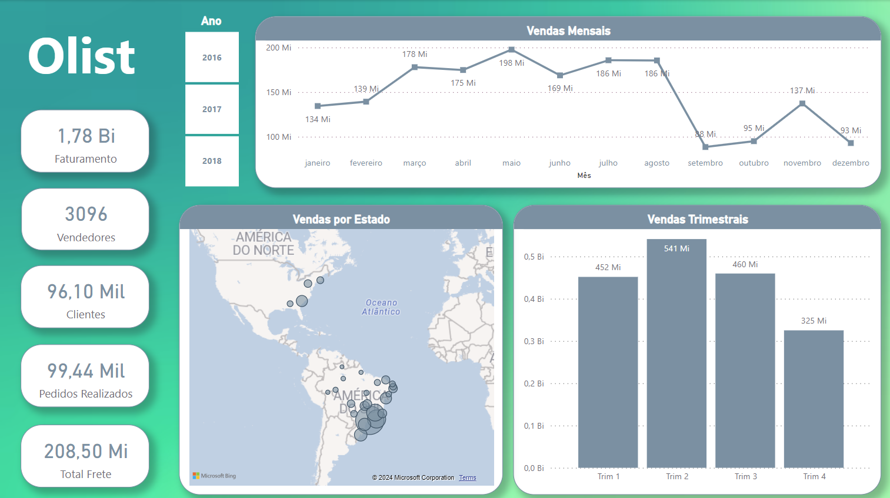
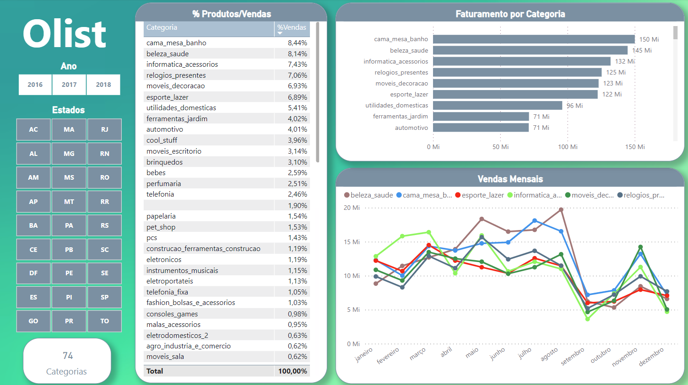

# Visualização Olist (PROJETO EM ANDAMENTO) 

### Este projeto é um estudo de visualização baseado em dados públicos da Olist fornecidos pela Kaggle. O projeto não pretende propor soluções para a empresa, sendo apenas um objeto de demonstração de habilidades analíticas e visuais.
- Dataset Link: https://www.kaggle.com/datasets/olistbr/brazilian-ecommerce

  

### Foram criadas querys em SQL afim de demosntrar noções da linguagem da mesma forma como foram criados dashboards no Power BI.

  

  

  

