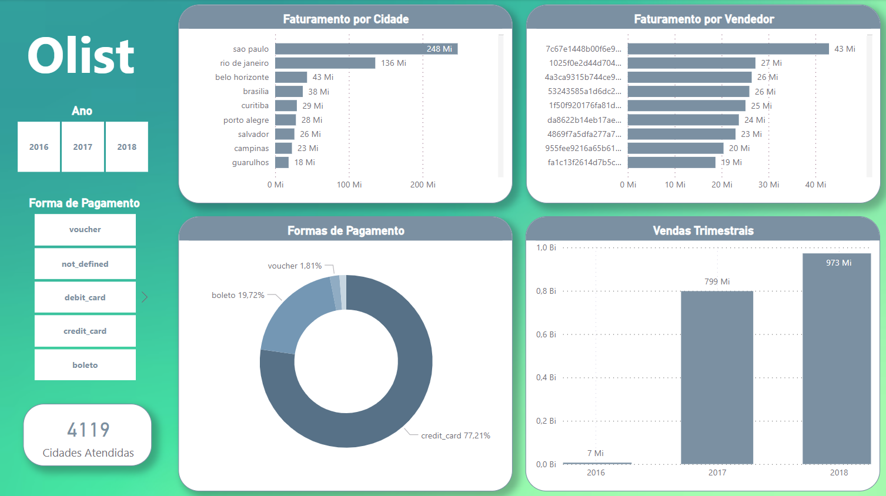

# Olist Visualization (ONGOING PROJECT)

### This project is a visualization study based on public data from Olist, provided by Kaggle. The project does not aim to propose solutions for the company but serves as a demonstration of analytical and visual skills.
- Dataset Link: https://www.kaggle.com/datasets/olistbr/brazilian-ecommerce

  

### SQL queries were created to demonstrate knowledge of the language, along with dashboards built in Power BI.

  

  

  

